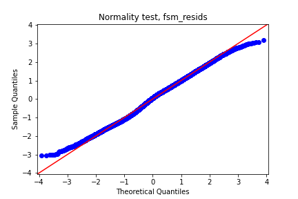
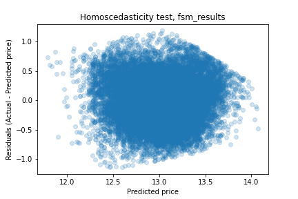
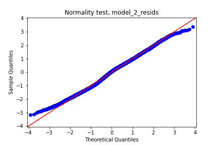
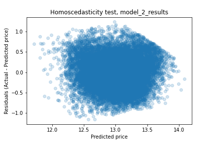
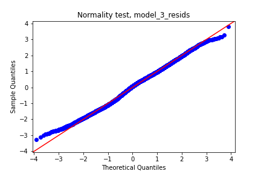
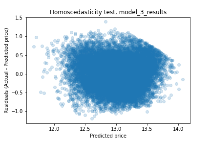
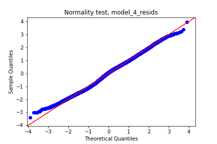
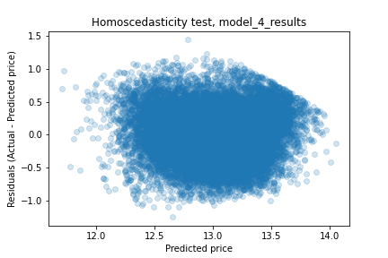

# Statistical Inferences into the Property Development Industry

**Author:** Nancy Ho

## Overview

For individuals and businesses who are new to property development, there are many difficult choices and decisions to navigate through when planning the construction and sale of their first homes. Through a statistical analysis of housing data from Kings County, Washington, we can learn what features go into the valuations of houses that go on the market and gain a better sense of what decisions should be made as new property developers.

## Business Problem

Property development is a broad process encompassing many other processes involved with developing infrastructure, including but not limited to purchasing plots of land, coordinating the construction of homes, and selling those homes to potential homeowners. You are put into a managerial position in charge of overseeing every step in the process of building a home and other real estate, and it can be a very rewarding business to engage in. However, these rewards are met with equally as great risks, and it can be hard to make decisions when starting out as a new developer; housing developers make the most meticulous decisions in order to maximize their profits in the end. Through a statistical analysis of housing data from Kings County, Washington, we can form a foundational insight into what kind of decisions to make. Some business questions we will try to answer to better understand property development are:

- What kinds of factors contribute to a house's base value?
- When building a house, what factors should we look out for before beginning the construction of property?
- What qualities do expensive houses have that cheaper houses don't?
- How does the condition of a house at the point of sale influence the value of a house?

By the end of this analysis, we will prepare you to make your own informed decisions as a new property developer.

## Data

For this analysis, we'll be using a .csv file, `kc_house_data.csv`, a set of data for houses in Kings County from the repository's `data` folder that shows the prices houses sold at and their other attributes from the time of sale. Information about the data in its entirety can be reviewed in the [`column_names.md`](./data/column_names.md) file, also found in the `data` folder.

## Methods

After loading in the dataset, to make the data easier to investigate and work with, we create a new dataframe with the columns that would be the least detrimental to our analysis. This includes variables that exhibit high multicollinearity with other variables and those with low correlation to the variable we want to focus on in this analysis, `price`. Once those variables are dropped, we observe that our data doesn't follow a normal distribution, so we perform log transformations and feature scaling on our continuous variables to lessen the amount of error in our analysis later.


## Results

Our first model only contained `sqft_living` as our only predictor model. Our R-squared was 0.412, meaning that this model only explains about 41.2% of the variance in housing price.

We also check for four assumptions of linear regression when creating a model to see how good it is at representing our data: linearity, normality, homoscedasticity, and independence. Using statistical tools, our first model passed the assumptions of linearity and independence, but not normality and homoscedasticity. For normality and homoscedasticity, we can also inspect for those visually:



Our distribution follows the normal distribution line closely with slight deviations at the min and max values.



The scatter plot shows a slight conal pattern to the right and some values don't seem to have an equal distribution across all the values of our target variable.

For our second model, we add `sqft_lot` to our model. Our R-squared increased to 0.422. Like the previous model, this model meets the assumptions of linearity and independence, but not normality or homoscedasticity. We can tell since our visualizations to check for those two assumptions don't seem to have undergone any significant changes.




For our third model, we add a categorical variable, `condition`. Once again, our R-squared increased to 0.429. Once again, this model met the assumptions of linearity and independence, but not normality or homoscedasticity, as we can see through the lack of changes to our plots.




Finally, we create a model including `floors`. Our R-squared increased to 0.432. Although this model also meets the linearity assumption, in addition to violating the normality and homoscedasticity assumption, it also violates the independence assumption; the metric that we use to check for independence shows that `floors` is somewhat collinear with `condition`.





## Conclusions
When we started out with our model containing `sqft_living` as our only predictor, we created a statistically significant model that explained just a minority of the variance in housing prices in Kings County. Our R-squared was 0.412 and while our model met the assumptions of linearity and independence, it failed to meet the other assumptions of normality and homoscedasticity.

As we added more features, our R-squared steadily improved, but our models still failed to meet the assumptions of normality and homoscedasticity. The best model that we made had `sqft_living`, `sqft_lot`, and `condition` as predictors. It had an R-squared of 0.429 and like our first model, met the assumptions of linearity but as mentioned, didn't meet those for normality or homoscedasticity. It also passed the independence assumption; the variance influence factors did not indicate any signs of multicollinearity. While the last model with `floors` included gave us a higher R-squared of 0.432, it also exhibited higher multicollinearity and may be more inaccurate as a result.

While we didn't end up creating the best models with our regression models, because they are still statistically significant we can still gain some sort of insight and direction from them. From those results, we can give these answers to our questions: 

1. *What kinds of factors contribute to a house's base value?*

Although our models didn't meet all the assumptions of linear regression, they were all statistically significant, so we can reasonably assume that all four features measured -- `sqft_living`, `sqft_lot`, `condition`, and `price` -- are all factors that can have an impact on a house's base value. Specifically, according to our best model:

- A house's base value with no features would be about 12.670.
- For each unit increase in the square footage of the house, price increases by 0.313.
- For each unit increase in the square footage of the lot, price decreases by 0.041.
- For each unit increase in a house's condition, price increases by 0.061.

Even though these parameters are statistically significant, it's also important to keep in mind that this model only explains about 42.9% of the variance in housing prices, which isn't a terrible proportion, but it hardly represents a good majority. 

2. *When building a house, what factors should we look out for before beginning the construction of property?*

One factor that we can pay attention to based on this model is the proportion between square footage of the house and the lot we build the lot on. In our model, price tended to decrease with square footage of the lot. While the lot size didn't show collinearity with the house size, one reason why lot size has a negative impact on the model may be because as more house is built, it means less free lot size.

3. *How does the condition of a house at the point of sale influence the value of a house?*

Significantly, but not by enough to make a notable difference. As we saw in our model, each increase in a house's condition score would only increase price by about 0.061. Condition may be more of a factor that influences whether a house is bought rather than a factor that influences its price.

4. *Are there specific features that add significant value to houses (e.g. rooms, floors)?*

Bedrooms and bathrooms didn't really contribute much to our model, so it's hard to speak on their influence on a house's base value. As for the number of floors, it's significant enough to impact the variance in prices, but not by much, only affecting price by about 0.067 in our last model.

### Next Steps

To try and create more reliable regression models that can better explain and answer our questions what impacts housing prices, there are some steps we can take going forward:

- Finding different ways to scale and transform data to gain better regression statistics, since transforming all our continuous data wasn't enough to improve the reliability of our results by much.
- Regression analysis on housing prices in other highly populated counties in the U.S. (Los Angeles, New York, etc.) and less populated counties in Washington to potentially discover other factors behind housing prices such as business and tourism.
- Using data about how housing prices change over time in response to economic factors (i.e. inflation) in conjunction with our data about house sales may help us be proactive in our decisions as prospective developers.

## For More Information

You can review the full analysis in the [Jupyter Notebook](./Property_Development_Analysis.ipynb) or the [presentation](./Property_Development_Analysis_Presentation.pdf)

For any additional questions, please contact **Nancy Ho** at [nancyho83@yahoo.com].

## Repository Structure
```
├── README.md                                            <- The top-level README for reviewers of this project
├── Property_Development_Analysis.ipynb                  <- Narrative documentation of analysis in Jupyter notebook
├── Property_Development_Analysis_unfiltered.ipynb       <- Supplement to main analysis Jupyter notebook
├── Property_Development_Analysis_Presentation.pdf       <- PDF version of project presentation
├── data                                                 <- Both sourced externally and generated from code
└── images                                               <- Both sourced externally and generated from code
```